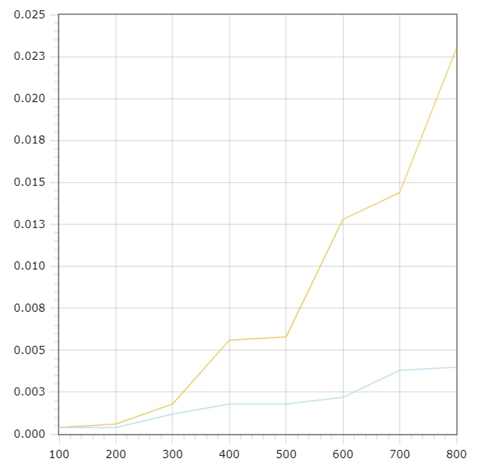

# Сравнение сортировок
Сортируется массив данных абитуриентов, поступающих в институт (800.txt)

Сортировка по полям: сумма баллов (по убыванию), ФИО

Используемые сортировки:
   *Сортировка выбором 
   *Пирамидальная сортировка
   
> Перегружены операторы сравнения

>На 7-10 наборах (размерности от 100 и болеее) программно засечено время и на основе полученных данных построены графики зависимости времени сортировки от размерности массива
для каждого из алгоритмов сортировки на одной оси координат

